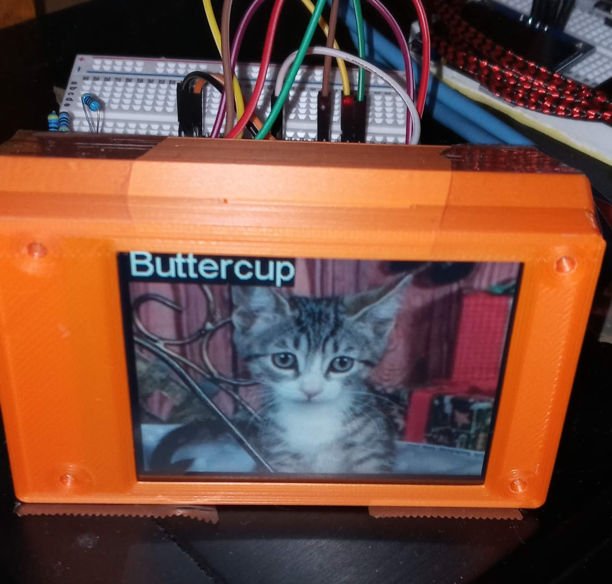

# esp32-petfinder

## What is this?

Stream Possible Pet Pics Perpetually ...

Uses the Pet Finder API - https://www.petfinder.com/developers/v2/docs/ 

## Why?
Guilt. Mostly. Get the pet you deserve!

## Requirements
- esp32
- Raspberry Pi or equivalent like EEE PC running linux
- 320x240 SPI Serial ILI9341 - https://www.amazon.com/dp/B09XHJ9KRX

## Setup

- In order to set this up you'll first install your esp32 on your wireless network and connect the ILI9341 screen to it.

- Since the esp32 is not powerful enough to process images and does not have the pillow package you'll need another computer like a Raspberry Pi to process the images. This machine will also be running Nginx (or any HTTP server) to serve the raw data to the ESP32 for it to consume and send to its screen.

- Since this is another outake from https://github.com/jouellnyc/ESP32-picbooth, you can find more details there, also the picbooth/ folder is literally the same 'client' that runs will on the ESP32 for  this project.

- Configs / Libraries shared in https://github.com/jouellnyc/mcconfigs 

## Warning 
- In process ..
- Cute Animals overload ..
